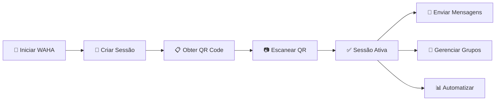

<div align="center">

# 🚀 WAHA WhatsApp MCP Server

### **Integração Completa do WhatsApp via Model Context Protocol**

[](https://fastmcp.com)
[](https://waha.devlike.pro)
[](https://python.org)

*Transforme seu WhatsApp em uma API poderosa acessível via MCP Tools*

</div>

---

## ✨ **O que é este projeto?**

Este é um **servidor MCP (Model Context Protocol)** que conecta seu **WhatsApp** a **qualquer LLM** através da API WAHA, permitindo que modelos de IA interajam diretamente com o WhatsApp para:

- 📱 **Enviar mensagens automaticamente**
- 👥 **Gerenciar grupos e contatos** 
- 🖼️ **Compartilhar mídia**
- 📊 **Automatizar workflows de comunicação**
- 🤖 **Criar assistentes conversacionais**

---

## 🎯 **Por que usar?**

<table>
<tr>
<td width="50%">

### 🔥 **Para Desenvolvedores**
- ⚡ Setup em **menos de 5 minutos**
- 🛠️ **40+ ferramentas** prontas para usar
- 📚 Documentação **crystal clear**
- 🔧 Configuração **zero-config**
- 🎨 Código **limpo e modular**

</td>
<td width="50%">

### 🚀 **Para Businesses**
- 💬 **Atendimento automatizado**
- 📈 **Notificações inteligentes**
- 👥 **Gestão de grupos em massa**
- 📊 **Analytics de conversas**
- 🔄 **Integração com CRM/ERP**

</td>
</tr>
</table>

---

## 🛠️ **Funcionalidades Épicas**

<details>
<summary><strong>🖥️ Gerenciamento de Sessões</strong> (6 ferramentas)</summary>

```python
# Controle total sobre suas sessões WhatsApp
list_sessions()                    # 📋 Lista todas as sessões
get_session_info(session)          # ℹ️  Status detalhado
start_session(session)             # ▶️  Iniciar conexão
stop_session(session)              # ⏹️  Parar sessão
get_qr_code(session)               # 📱 QR para autenticação
get_my_profile(session)            # 👤 Dados do perfil
```
</details>

<details>
<summary><strong>📤 Sistema de Mensagens</strong> (8 ferramentas)</summary>

```python
# Envie qualquer tipo de conteúdo
send_text_message(chat_id, text)                    # 💬 Texto simples
send_image_from_url(chat_id, url, caption)          # 🖼️ Imagem da web
send_image_base64(chat_id, data, filename)          # 📸 Imagem local
send_file_from_url(chat_id, url, filename)          # 📎 Qualquer arquivo
mark_as_read(chat_id)                               # ✅ Marcar como lido
start_typing(chat_id)                               # ⌨️  Indicador de digitação
stop_typing(chat_id)                                # ⏸️  Parar digitação
check_number_status(phone)                          # 🔍 Verificar número
```
</details>

<details>
<summary><strong>💬 Gerenciamento de Chats</strong> (4 ferramentas)</summary>

```python
# Controle total sobre conversas
get_chats()                                         # 📜 Lista de chats
get_chat_messages(chat_id, limit)                   # 💭 Histórico de mensagens
archive_chat(chat_id)                               # 📦 Arquivar conversa
unarchive_chat(chat_id)                             # 📤 Desarquivar
```
</details>

<details>
<summary><strong>👤 Sistema de Contatos</strong> (6 ferramentas)</summary>

```python
# Gestão completa de contatos
get_all_contacts()                                  # 📇 Lista completa
get_contact_info(contact_id)                        # ℹ️  Detalhes do contato
get_contact_profile_picture(contact_id)             # 🖼️ Foto de perfil
block_contact(contact_id)                           # 🚫 Bloquear
unblock_contact(contact_id)                         # ✅ Desbloquear
check_number_status(phone)                          # 📱 Status no WhatsApp
```
</details>

<details>
<summary><strong>👥 Administração de Grupos</strong> (8 ferramentas)</summary>

```python
# Poder total sobre grupos
create_group(name, participants)                    # ➕ Criar grupo
get_groups()                                        # 📋 Lista de grupos
get_group_info(group_id)                           # ℹ️  Detalhes do grupo
add_group_participants(group_id, participants)      # 👥 Adicionar membros
remove_group_participants(group_id, participants)   # ➖ Remover membros
get_group_invite_code(group_id)                     # 🔗 Código de convite
leave_group(group_id)                               # 🚪 Sair do grupo
```
</details>

<details>
<summary><strong>🔍 Monitoramento & Debug</strong> (3 ferramentas)</summary>

```python
# Mantenha tudo sob controle
ping_server()                                       # 🏓 Status do servidor
get_server_version()                                # 📋 Versão atual
get_server_status()                                 # 📊 Métricas detalhadas
```
</details>

---

## ⚡ **Setup Ultra-Rápido**

### Installing via Smithery

To install FastMCP for Claude Desktop automatically via [Smithery](https://smithery.ai/server/@fellipesaraiva88/fastmcp):

```bash
npx -y @smithery/cli install @fellipesaraiva88/fastmcp --client claude
```

### 1️⃣ **Clone e Instale**
```bash
# Clone o projeto
git clone <repository>
cd fastmcp/examples

# Instale dependências
pip install fastmcp httpx pydantic pydantic-settings
```

### 2️⃣ **Execute o WAHA**
```bash
# Opção 1: Docker (Recomendado)
docker run -it --rm -p 3000:3000/tcp devlikeapro/waha

# Opção 2: Docker Compose
# Crie um docker-compose.yml (veja exemplo abaixo)
docker-compose up -d
```

### 3️⃣ **Configure (Opcional)**
```bash
# Copie o arquivo de exemplo
cp .env.waha.example .env

# Edite suas configurações
nano .env
```

### 4️⃣ **Execute o MCP**
```bash
# Versão simples (6 ferramentas)
python waha_simple.py

# Versão completa (40+ ferramentas)  
python waha_whatsapp.py
```

### 5️⃣ **Teste Tudo**
```bash
# Teste básico de conexão
python demo_waha.py test

# Demo completa
python demo_waha.py
```

---

## 🎨 **Configuração Flexível**

<table>
<tr>
<td width="50%">

### 📄 **Via arquivo .env**
```env
WAHA_BASE_URL=http://localhost:3000
WAHA_API_KEY=sua_chave_secreta
WAHA_DEFAULT_SESSION=producao
```

</td>
<td width="50%">

### 🔧 **Via código**
```python
# Edite no início dos arquivos
BASE_URL = "http://localhost:3000"
DEFAULT_SESSION = "minha_sessao"
```

</td>
</tr>
</table>

---

## 🎯 **Fluxo de Trabalho Mágico**



---

## 💡 **Exemplos Práticos**

### 🤖 **Bot de Atendimento**
```python
# Resposta automática
def auto_responder():
    chats = get_chats()
    for chat in chats:
        messages = get_chat_messages(chat['id'], 1)
        if messages and not messages[0]['fromMe']:
            send_text_message(chat['id'], 
                "Obrigado pela mensagem! Em breve retornaremos.")
```

### 📈 **Notificações de Sistema**
```python
# Alertas para administradores
def send_alert(message, urgency="normal"):
    admin_group = "123456789-admin@g.us"
    emoji = "🚨" if urgency == "high" else "ℹ️"
    send_text_message(admin_group, f"{emoji} {message}")
```

### 👥 **Gestão de Grupos em Massa**
```python
# Adicionar usuário em múltiplos grupos
def add_to_multiple_groups(user_phone, group_list):
    for group_id in group_list:
        add_group_participants(group_id, [user_phone])
        send_text_message(group_id, f"🎉 Bem-vindo(a), {user_phone}!")
```

---

## 🐳 **Docker Compose Setup**

Crie um `docker-compose.yml` para facilitar o deploy:

```yaml
version: '3.8'
services:
  waha:
    image: devlikeapro/waha
    restart: unless-stopped
    ports:
      - "3000:3000"
    environment:
      WAHA_WEBHOOK_URL: http://localhost:3001/webhook
      WAHA_WEBHOOK_EVENTS: message,session.status
    volumes:
      - ./sessions:/app/sessions

  mcp-server:
    build: .
    restart: unless-stopped
    depends_on:
      - waha
    environment:
      WAHA_BASE_URL: http://waha:3000
    volumes:
      - ./logs:/app/logs
```

---

## 📱 **Formatos de Chat ID**

<table>
<tr>
<th width="30%">Tipo</th>
<th width="35%">Formato</th>
<th width="35%">Exemplo</th>
</tr>
<tr>
<td>🇧🇷 <strong>Número BR</strong></td>
<td><code>55XXXXXXXXXXX</code></td>
<td><code>5511999999999</code></td>
</tr>
<tr>
<td>🌍 <strong>Internacional</strong></td>
<td><code>CCXXXXXXXXXX</code></td>
<td><code>1234567890</code></td>
</tr>
<tr>
<td>👥 <strong>Grupo</strong></td>
<td><code>XXXXX-XXXXX@g.us</code></td>
<td><code>12345-67890@g.us</code></td>
</tr>
<tr>
<td>⚡ <strong>Auto-Format</strong></td>
<td><code>Número sem @</code></td>
<td><code>5511999999999</code> → <code>5511999999999@c.us</code></td>
</tr>
</table>

---

## 🔥 **Use Cases Reais**

<div align="center">

### 🏢 **Para Empresas**

</div>

<table>
<tr>
<td width="33%">

#### 🤖 **Atendimento 24/7**
- Respostas automáticas
- FAQ inteligente  
- Escalamento para humanos
- Histórico completo

</td>
<td width="33%">

#### 📊 **Alertas & Dashboards**
- Notificações de sistema
- Relatórios automáticos
- Alertas de vendas
- Status de serviços

</td>
<td width="33%">

#### 👥 **Gestão de Equipes**
- Grupos organizacionais
- Broadcasts corporativos
- Integração com CRM
- Automação de workflows

</td>
</tr>
</table>

<div align="center">

### 🚀 **Para Desenvolvedores**

</div>

<table>
<tr>
<td width="33%">

#### 🔧 **Monitoramento**
- Alertas de erro
- Status de servidores
- Deploy notifications
- Health checks

</td>
<td width="33%">

#### 🎯 **Marketing Automation**
- Campanhas segmentadas
- A/B testing
- Analytics em tempo real
- ROI tracking

</td>
<td width="33%">

#### 🔄 **Integrações**
- APIs terceirizadas
- Webhooks
- Pipelines CI/CD
- Database sync

</td>
</tr>
</table>

---

## 🛡️ **Segurança & Boas Práticas**

### ✅ **Recomendações**
- 🔐 **Use HTTPS** em produção
- 🔑 **Rotacione API keys** regularmente  
- 📝 **Log todas as ações** importantes
- 🚫 **Rate limiting** para evitar spam
- 🔒 **Validação de entrada** sempre

### ⚠️ **Limitações do WhatsApp**
- 📱 **1 sessão** por número
- ⏱️ **Rate limits** da API oficial
- 🚫 **Números bloqueados** podem afetar entrega
- 📋 **ToS WhatsApp** devem ser respeitados

---

## 🐛 **Troubleshooting**

<details>
<summary><strong>❌ Erro de Conexão</strong></summary>

```bash
# Verifique se WAHA está rodando
curl http://localhost:3000/ping

# Verifique logs do Docker
docker logs waha-container

# Teste conectividade
telnet localhost 3000
```
</details>

<details>
<summary><strong>📱 QR Code não aparece</strong></summary>

```python
# Force restart da sessão
stop_session("default")
start_session("default")
get_qr_code("default")

# Verifique status
get_session_info("default")
```
</details>

<details>
<summary><strong>💬 Mensagem não enviada</strong></summary>

```python
# 1. Verifique número
status = check_number_status("5511999999999")

# 2. Confirme sessão ativa  
session = get_session_info("default")

# 3. Teste com número conhecido
send_text_message("5511999999999", "Teste")
```
</details>

<details>
<summary><strong>🔧 Performance Issues</strong></summary>

- **Limite mensagens simultâneas**: Max 10/segundo
- **Use connection pooling**: httpx.AsyncClient()
- **Cache session info**: Evite calls desnecessários
- **Monitor memory**: Grupos grandes consomem RAM
</details>

---

## 🎓 **Tutoriais Avançados**

### 🔄 **Webhook Setup**
```python
from fastapi import FastAPI
from fastmcp import FastMCP

app = FastAPI()
mcp = FastMCP("WAHA Advanced")

@app.post("/webhook/message")
async def handle_message(data: dict):
    if not data.get('fromMe'):
        # Processar mensagem recebida
        await process_incoming_message(data)
    
@mcp.tool
async def process_incoming_message(message_data: dict):
    # Sua lógica aqui
    pass
```

### 📊 **Analytics & Metrics**
```python
import time
from collections import defaultdict

class WhatsAppAnalytics:
    def __init__(self):
        self.metrics = defaultdict(int)
        
    def track_message(self, chat_id: str, message_type: str):
        self.metrics[f"messages_{message_type}"] += 1
        self.metrics[f"chat_{chat_id}"] += 1
        
    def get_top_chats(self, limit: int = 10):
        chat_metrics = {k: v for k, v in self.metrics.items() 
                       if k.startswith('chat_')}
        return sorted(chat_metrics.items(), 
                     key=lambda x: x[1], reverse=True)[:limit]
```

---

## 🤝 **Contribuindo**

Adoramos contribuições! Aqui está como você pode ajudar:

1. 🍴 **Fork** o repositório
2. 🌟 **Crie** uma branch para sua feature
3. ✅ **Teste** tudo thoroughly  
4. 📝 **Documente** suas mudanças
5. 🚀 **Envie** um Pull Request

### 📋 **Checklist para PRs**
- [ ] ✅ Testes passando
- [ ] 📚 Documentação atualizada
- [ ] 🎨 Código formatado (black/flake8)
- [ ] 🔍 Type hints adicionados
- [ ] 📝 Changelog atualizado

---

## 📚 **Recursos Extras**

### 🔗 **Links Úteis**
- 📖 [Documentação WAHA](https://waha.devlike.pro/)
- 🐙 [WAHA GitHub](https://github.com/devlikeapro/waha)
- ⚡ [FastMCP Docs](https://fastmcp.com/)
- 💬 [WhatsApp Business API](https://business.whatsapp.com/)

### 🎯 **Roadmap**
- [ ] 🔊 **Suporte a áudio/voz**
- [ ] 📋 **Polls e interações**
- [ ] 🏷️ **Labels e tags**
- [ ] 📺 **Status/Stories**
- [ ] 🤖 **AI-powered responses**
- [ ] 📊 **Dashboard web**

---

<div align="center">

## ⭐ **Gostou do projeto?**

**Dê uma estrela no repositório e compartilhe com seus amigos!**

[](https://github.com/your-repo/fastmcp)
[](https://twitter.com/yourhandle)

---

### 📄 **Licença**

Este projeto está sob a licença MIT. Veja [LICENSE](LICENSE) para mais detalhes.

---

**Feito com ❤️ para a comunidade brasileira de desenvolvedores**

*Última atualização: Junho 2025*

</div>
