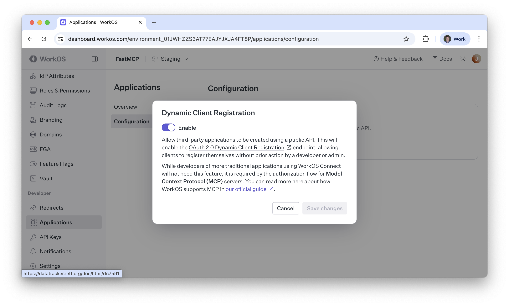

import { VersionBadge } from "/snippets/version-badge.mdx"

<VersionBadge version="2.11.0" />

This guide shows you how to secure your FastMCP server using **WorkOS AuthKit**, a complete authentication and user management solution. This integration uses the [**Remote Authorization**](/servers/auth/remote-authorization) pattern, where WorkOS handles user login and your FastMCP server validates the tokens.

## Prerequisites

Before you begin, you will need:
1.  A **WorkOS Account** and a new **Project**.
2.  An **AuthKit** instance configured within your WorkOS project.
3.  Your FastMCP server's URL (can be localhost for development, e.g., `http://localhost:8000`).

## Step 1: Configure Your AuthKit Instance

In your WorkOS Dashboard, navigate to your AuthKit instance and configure the following settings:

<Steps>
<Step title="Enable Dynamic Client Registration">
    Go to **Applications → Configuration** and enable **Dynamic Client Registration**. This allows MCP clients register with your application automatically.

    
</Step>

<Step title="Add Your Redirect URI">
    Go to the **Redirects** tab and add your FastMCP server's URL. This is where WorkOS will redirect users after authentication.
    
    For development: `http://localhost:8000`  
    For production: `https://my-fastmcp-app.com`
</Step>

<Step title="Note Your AuthKit Domain">
    Find your **AuthKit Domain** on the configuration page. It will look like `https://your-project-12345.authkit.app`. You'll need this for your FastMCP server configuration.
</Step>
</Steps>

## Step 2: Configure Your FastMCP Server

Create your FastMCP server file. The `AuthKitProvider` handles all the OAuth integration automatically:

```python server.py
from fastmcp import FastMCP
from fastmcp.server.auth.providers.workos import AuthKitProvider

# The AuthKitProvider automatically discovers WorkOS endpoints
# and configures JWT token validation
auth_provider = AuthKitProvider(
    authkit_domain="https://your-project-12345.authkit.app",
    base_url="http://localhost:8000"  # Use your actual server URL
)

mcp = FastMCP(name="WorkOS Secured App", auth=auth_provider)
```

## Step 3: Environment Variables (Optional)

For production deployments, set these environment variables however you prefer:

```bash
FASTMCP_SERVER_AUTH=AUTHKIT
FASTMCP_SERVER_AUTH_AUTHKITPROVIDER_AUTHKIT_DOMAIN="https://your-project-12345.authkit.app"
FASTMCP_SERVER_AUTH_AUTHKITPROVIDER_BASE_URL="https://my-fastmcp-app.com"
```

For clarity, you do **not** need to instantiate an auth provider when using environment variables:

```python server.py
from fastmcp import FastMCP

# FastMCP automatically creates the AuthKitProvider from environment variables
mcp = FastMCP(name="WorkOS Secured App")
```

## How It Works

The `AuthKitProvider` implements the remote authorization pattern by setting up discovery endpoints that point clients to WorkOS for authentication:

1. **Discovery**: When an MCP client connects, it checks `/.well-known/oauth-protected-resource` and learns that WorkOS (`https://your-project.authkit.app`) handles authentication for this server.

2. **Client Registration**: The client goes directly to WorkOS (using the forwarded metadata from `/.well-known/oauth-authorization-server`) and registers itself using Dynamic Client Registration.

3. **User Authentication**: The client redirects the user to WorkOS's AuthKit login page for authentication and consent.

4. **Token Issuance**: After successful login, WorkOS issues a JWT access token to the client.

5. **Protected Requests**: The client makes MCP requests with the JWT token in the `Authorization: Bearer` header.

6. **Token Verification**: Your FastMCP server validates each token using WorkOS's public keys (automatically fetched from their JWKS endpoint).

Your server is now secured with WorkOS's enterprise-grade authentication, including SSO, directory sync, and user management capabilities.