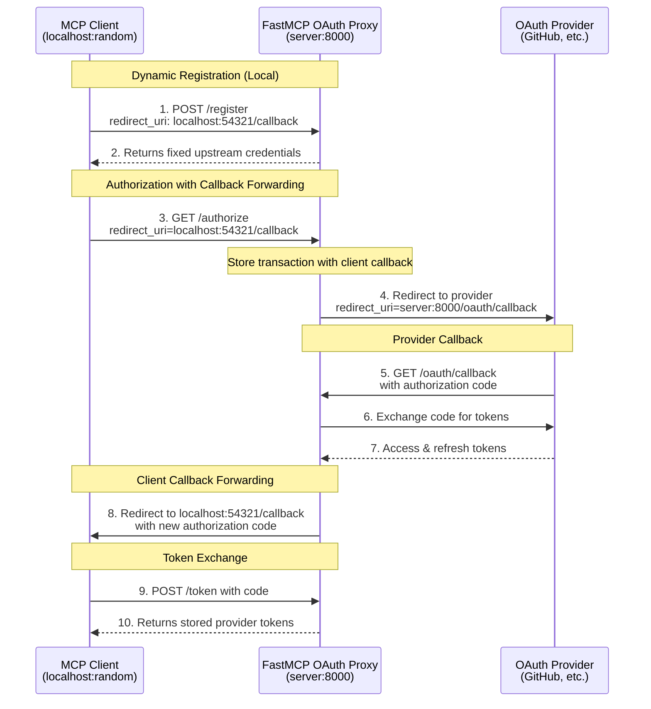

import { VersionBadge } from "/snippets/version-badge.mdx"

<VersionBadge version="2.11.3" />

OAuth Proxy enables your FastMCP server to authenticate with third-party OAuth providers that don't support Dynamic Client Registration (DCR). This includes major providers like GitHub, Google, Azure, and most enterprise identity systems. The proxy acts as a bridge, implementing DCR locally while forwarding OAuth flows to upstream providers.

<Tip>
OAuth Proxy is the recommended approach for integrating with existing OAuth providers that have pre-registered applications. It provides seamless authentication without requiring providers to support DCR.
</Tip>

## The DCR Problem

The MCP specification assumes OAuth providers support Dynamic Client Registration - the ability for clients to automatically register themselves and obtain credentials. This works well with modern providers like WorkOS, but fails with traditional OAuth providers that require manual app registration.

Most established OAuth providers require you to:
- Manually register your application through their developer console
- Obtain a fixed client ID and client secret
- Configure specific redirect URIs in advance
- Manage these credentials securely

This creates a fundamental incompatibility: MCP clients expect to register dynamically, but your OAuth provider only accepts pre-registered credentials. The OAuth Proxy solves this by presenting a DCR-compatible interface to MCP clients while using your fixed credentials with the upstream provider.

## How OAuth Proxy Works

The OAuth Proxy implements an intelligent callback forwarding pattern that solves both the DCR problem and the redirect URI mismatch issue:



### The Callback Forwarding Breakthrough

The OAuth Proxy solves the fundamental redirect URI problem that has plagued OAuth integrations:

**The Problem:**
- MCP clients use dynamic localhost ports (e.g., `http://localhost:54321/callback`)
- OAuth providers require pre-registered, fixed redirect URIs
- Result: "redirect_uri not associated with application" errors

**The Solution:**
1. **Client Registration**: Client registers with any localhost callback URL
2. **Transaction Storage**: Proxy stores client's callback URL and PKCE challenge
3. **Provider Redirect**: Proxy redirects to provider with its own fixed callback (`/oauth/callback`)
4. **Server-Side Exchange**: Proxy receives provider callback and exchanges code for tokens
5. **Client Forwarding**: Proxy redirects to client's original callback with a new code
6. **Token Delivery**: Client exchanges the new code for the provider's tokens

This enables any MCP client to work with any OAuth provider, regardless of redirect URI restrictions.

## Basic Implementation

The `OAuthProxy` class provides the complete proxy implementation:

<Card icon="code" title="OAuthProxy Constructor Parameters">
<ParamField body="upstream_authorization_endpoint" type="str" required>
  URL of your OAuth provider's authorization endpoint (e.g., `https://github.com/login/oauth/authorize`)
</ParamField>

<ParamField body="upstream_token_endpoint" type="str" required>
  URL of your OAuth provider's token endpoint (e.g., `https://github.com/login/oauth/access_token`)
</ParamField>

<ParamField body="upstream_client_id" type="str" required>
  Client ID from your registered OAuth application
</ParamField>

<ParamField body="upstream_client_secret" type="str" required>
  Client secret from your registered OAuth application
</ParamField>

<ParamField body="token_verifier" type="TokenVerifier" required>
  A [`TokenVerifier`](/servers/auth/token-verification) instance to validate the provider's tokens
</ParamField>

<ParamField body="base_url" type="AnyHttpUrl | str" required>
  Public URL of your FastMCP server (e.g., `https://your-server.com`)
</ParamField>

<ParamField body="redirect_path" type="str" default="/oauth/callback">
  Path for OAuth callbacks. Must match the redirect URI configured in your OAuth application
</ParamField>

<ParamField body="upstream_revocation_endpoint" type="str | None">
  Optional URL of provider's token revocation endpoint
</ParamField>

<ParamField body="issuer_url" type="AnyHttpUrl | str | None">
  Issuer URL for OAuth metadata (defaults to base_url)
</ParamField>

<ParamField body="service_documentation_url" type="AnyHttpUrl | str | None">
  Optional URL to your service documentation
</ParamField>

<ParamField body="resource_server_url" type="AnyHttpUrl | str | None">
  Resource server URL (defaults to base_url)
</ParamField>
</Card>

```python
from fastmcp import FastMCP
from fastmcp.server.auth.providers.proxy import OAuthProxy
from fastmcp.server.auth.providers.jwt import JWTVerifier

# Configure token validation for your provider
token_verifier = JWTVerifier(
    jwks_uri="https://your-provider.com/.well-known/jwks.json",
    issuer="https://your-provider.com",
    audience="your-app-id"
)

# Create the OAuth proxy (accepts strings for URLs)
auth = OAuthProxy(
    # Upstream provider endpoints
    upstream_authorization_endpoint="https://your-provider.com/oauth/authorize",
    upstream_token_endpoint="https://your-provider.com/oauth/token",
    
    # Your registered app credentials
    upstream_client_id="your-registered-client-id",
    upstream_client_secret="your-registered-client-secret",
    
    # Token validation
    token_verifier=token_verifier,
    
    # Your FastMCP server URL (string automatically converted to AnyHttpUrl)
    base_url="https://your-server.com",
    
    # Optional: customize callback path (defaults to "/oauth/callback")
    redirect_path="/oauth/callback"
)

mcp = FastMCP(name="My Server", auth=auth)
```

### OAuth Provider Configuration

When registering your application with your OAuth provider, configure the redirect/callback URL as:

```
https://your-server.com/oauth/callback
```

For local development with providers that support it (like GitHub):

```
http://localhost:8000/oauth/callback
```

The proxy automatically:
- Implements DCR by returning your fixed credentials to any client that registers
- Handles callback forwarding between dynamic client callbacks and your fixed provider callback
- Exchanges authorization codes server-side for enhanced security
- Validates tokens using your provider's public keys or API
- Maintains PKCE security throughout the flow

## Client Compatibility

<Tip>
The OAuth Proxy's callback forwarding enables **any MCP client** to authenticate with **any OAuth provider**, regardless of redirect URI restrictions. Clients can use dynamic localhost ports while providers see their expected fixed callbacks.
</Tip>

This breakthrough means that MCP clients no longer need to worry about registering specific callback URLs with OAuth providers. The proxy handles the complexity of bridging dynamic client callbacks with the fixed URLs that providers require. The entire flow maintains OAuth 2.1 and PKCE (RFC-7636) compliance for security.

## Token Verification

The `OAuthProxy` requires a [`TokenVerifier`](/servers/auth/token-verification) instance to validate tokens from your OAuth provider. The token verifier determines how tokens are validated:

- **JWT tokens**: Use `JWTVerifier` with the provider's JWKS endpoint for offline validation
- **Opaque tokens**: Implement a custom `TokenVerifier` subclass that validates tokens via API calls

FastMCP includes provider-specific implementations like `GitHubOAuthProxyProvider` that include appropriate token verifiers for their token formats. For other providers, you'll need to provide a token verifier that matches how that provider's tokens work.

## Environment Configuration

OAuth Proxy supports environment-based configuration for production deployments:

```bash
# Provider selection
export FASTMCP_SERVER_AUTH=OAUTH_PROXY

# OAuth endpoints
export FASTMCP_SERVER_AUTH_OAUTH_PROXY_UPSTREAM_AUTHORIZATION_ENDPOINT="https://github.com/login/oauth/authorize"
export FASTMCP_SERVER_AUTH_OAUTH_PROXY_UPSTREAM_TOKEN_ENDPOINT="https://github.com/login/oauth/access_token"

# Credentials (use secrets management in production)
export FASTMCP_SERVER_AUTH_OAUTH_PROXY_UPSTREAM_CLIENT_ID="Ov23li..."
export FASTMCP_SERVER_AUTH_OAUTH_PROXY_UPSTREAM_CLIENT_SECRET="abc123..."

# Token validation
export FASTMCP_SERVER_AUTH_OAUTH_PROXY_TOKEN_VERIFIER="JWT"
export FASTMCP_SERVER_AUTH_OAUTH_PROXY_JWKS_URI="https://provider.com/.well-known/jwks.json"
export FASTMCP_SERVER_AUTH_OAUTH_PROXY_ISSUER="https://provider.com"
export FASTMCP_SERVER_AUTH_OAUTH_PROXY_AUDIENCE="your-app-id"

# Server URL
export FASTMCP_SERVER_AUTH_OAUTH_PROXY_BASE_URL="https://your-server.com"
```

With environment variables configured, your code becomes:

```python
from fastmcp import FastMCP

# Authentication automatically configured from environment
mcp = FastMCP(name="My Server")
```