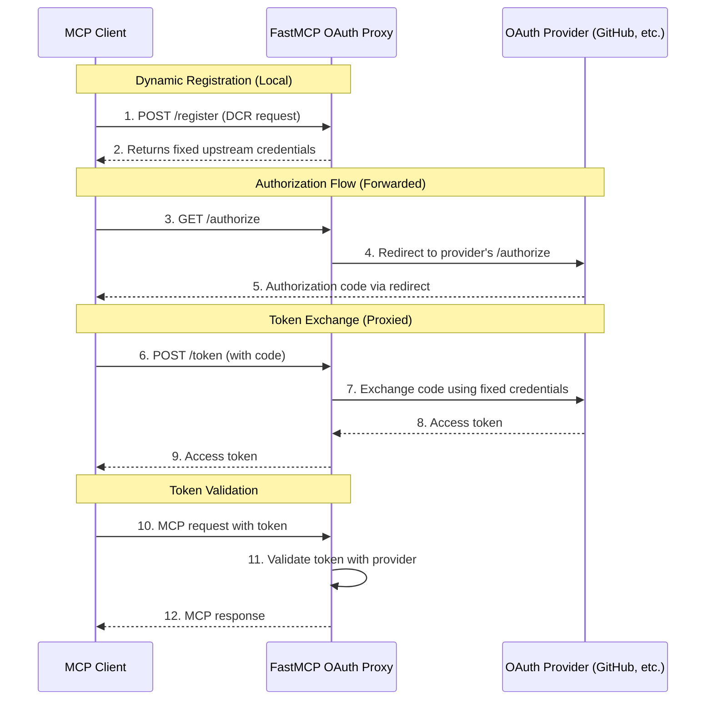

import { VersionBadge } from "/snippets/version-badge.mdx"

<VersionBadge version="2.11.3" />

OAuth Proxy enables your FastMCP server to authenticate with third-party OAuth providers that don't support Dynamic Client Registration (DCR). This includes major providers like GitHub, Google, Azure, and most enterprise identity systems. The proxy acts as a bridge, implementing DCR locally while forwarding OAuth flows to upstream providers.

<Tip>
OAuth Proxy is the recommended approach for integrating with existing OAuth providers that have pre-registered applications. It provides seamless authentication without requiring providers to support DCR.
</Tip>

## The DCR Problem

The MCP specification assumes OAuth providers support Dynamic Client Registration - the ability for clients to automatically register themselves and obtain credentials. This works well with modern providers like WorkOS, but fails with traditional OAuth providers that require manual app registration.

Most established OAuth providers require you to:
- Manually register your application through their developer console
- Obtain a fixed client ID and client secret
- Configure specific redirect URIs in advance
- Manage these credentials securely

This creates a fundamental incompatibility: MCP clients expect to register dynamically, but your OAuth provider only accepts pre-registered credentials. The OAuth Proxy solves this by presenting a DCR-compatible interface to MCP clients while using your fixed credentials with the upstream provider.

## How OAuth Proxy Works

The OAuth Proxy implements a transparent forwarding pattern that makes non-DCR providers compatible with MCP's authentication flow:



The key insight is that the proxy handles DCR locally - always returning the same fixed credentials you've configured - while transparently forwarding the actual OAuth flow to your provider. This gives MCP clients the DCR experience they expect while working with providers that don't support it.

## Basic Implementation

The `OAuthProxy` class provides the complete proxy implementation. To use it, you need:

- **OAuth endpoints**: Your provider's authorization and token endpoints
- **App credentials**: The client ID and secret from your registered OAuth application  
- **Token verifier**: A [`TokenVerifier`](/servers/auth/token-verification) instance to validate the provider's tokens
- **Server URL**: Your FastMCP server's base URL

```python
from fastmcp import FastMCP
from fastmcp.server.auth.providers.proxy import OAuthProxy
from fastmcp.server.auth.providers.jwt import JWTVerifier

# Configure token validation for your provider
token_verifier = JWTVerifier(
    jwks_uri="https://your-provider.com/.well-known/jwks.json",
    issuer="https://your-provider.com",
    audience="your-app-id"
)

# Create the OAuth proxy
auth = OAuthProxy(
    # Upstream provider endpoints
    upstream_authorization_endpoint="https://your-provider.com/oauth/authorize",
    upstream_token_endpoint="https://your-provider.com/oauth/token",
    
    # Your registered app credentials
    upstream_client_id="your-registered-client-id",
    upstream_client_secret="your-registered-client-secret",
    
    # Token validation
    token_verifier=token_verifier,
    
    # Your FastMCP server URL
    base_url="https://your-server.com"
)

mcp = FastMCP(name="My Server", auth=auth)
```

The proxy automatically:
- Implements DCR by returning your fixed credentials to any client that registers
- Forwards authorization requests to your provider
- Exchanges authorization codes using your registered credentials
- Validates tokens using your provider's public keys or API

## Token Verification

The `OAuthProxy` requires a [`TokenVerifier`](/servers/auth/token-verification) instance to validate tokens from your OAuth provider. The token verifier determines how tokens are validated:

- **JWT tokens**: Use `JWTVerifier` with the provider's JWKS endpoint for offline validation
- **Opaque tokens**: Implement a custom `TokenVerifier` subclass that validates tokens via API calls

FastMCP includes provider-specific implementations like `GitHubProvider` that include appropriate token verifiers for their token formats. For other providers, you'll need to provide a token verifier that matches how that provider's tokens work.

## Environment Configuration

OAuth Proxy supports environment-based configuration for production deployments:

```bash
# Provider selection
export FASTMCP_SERVER_AUTH=OAUTH_PROXY

# OAuth endpoints
export FASTMCP_SERVER_AUTH_OAUTH_PROXY_UPSTREAM_AUTHORIZATION_ENDPOINT="https://github.com/login/oauth/authorize"
export FASTMCP_SERVER_AUTH_OAUTH_PROXY_UPSTREAM_TOKEN_ENDPOINT="https://github.com/login/oauth/access_token"

# Credentials (use secrets management in production)
export FASTMCP_SERVER_AUTH_OAUTH_PROXY_UPSTREAM_CLIENT_ID="Ov23li..."
export FASTMCP_SERVER_AUTH_OAUTH_PROXY_UPSTREAM_CLIENT_SECRET="abc123..."

# Token validation
export FASTMCP_SERVER_AUTH_OAUTH_PROXY_TOKEN_VERIFIER="JWT"
export FASTMCP_SERVER_AUTH_OAUTH_PROXY_JWKS_URI="https://provider.com/.well-known/jwks.json"
export FASTMCP_SERVER_AUTH_OAUTH_PROXY_ISSUER="https://provider.com"
export FASTMCP_SERVER_AUTH_OAUTH_PROXY_AUDIENCE="your-app-id"

# Server URL
export FASTMCP_SERVER_AUTH_OAUTH_PROXY_BASE_URL="https://your-server.com"
```

With environment variables configured, your code becomes:

```python
from fastmcp import FastMCP

# Authentication automatically configured from environment
mcp = FastMCP(name="My Server")
```