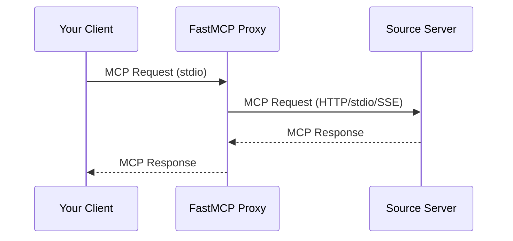

import { VersionBadge } from '/snippets/version-badge.mdx'

<VersionBadge version="2.0.0" />

The Proxy Provider sources components from another MCP server through a client connection. This lets you expose any MCP server's tools, resources, and prompts through your own server, whether the source is local or accessed over the network.

## Why Use Proxy Provider

The Proxy Provider enables:

- **Bridge transports**: Make an HTTP server available via stdio, or vice versa
- **Aggregate servers**: Combine multiple source servers into one unified server
- **Add security**: Act as a controlled gateway with authentication and authorization
- **Simplify access**: Provide a stable endpoint even if backend servers change



## Quick Start

<VersionBadge version="2.10.3" />

Create a proxy using `create_proxy()`:

```python
from fastmcp.server import create_proxy

# create_proxy() accepts URLs, file paths, and transports directly
proxy = create_proxy("http://example.com/mcp", name="MyProxy")

if __name__ == "__main__":
    proxy.run()
```

This gives you:

- Safe concurrent request handling
- Automatic forwarding of MCP features (sampling, elicitation, etc.)
- Session isolation to prevent context mixing

<Tip>
To mount a proxy inside another FastMCP server, see [Mounting External Servers](/servers/composition#mounting-external-servers).
</Tip>

## Connection Semantics

FastMCP proxies are lazy bridges. Creating the proxy object and starting the local server do not contact the upstream server. The upstream connection begins when an MCP client sends an `initialize` request to the proxy.

During initialization, the proxy initializes the upstream server before responding locally. If the upstream server is unavailable, the URL does not point to an MCP endpoint, or upstream authentication cannot complete, the proxy initialization fails. This keeps the local proxy's connection status aligned with the upstream server it represents.

After initialization, the proxy forwards MCP requests such as `ping`, `tools/list`, `resources/list`, `prompts/list`, tool calls, resource reads, sampling, elicitation, logging, and progress through the upstream client.

## Transport Bridging

A common use case is bridging transports between servers:

```python
from fastmcp.server import create_proxy

# Bridge HTTP server to local stdio
http_proxy = create_proxy("http://example.com/mcp/sse", name="HTTP-to-stdio")

# Run locally via stdio for Claude Desktop
if __name__ == "__main__":
    http_proxy.run()  # Defaults to stdio
```

Or expose a local server via HTTP:

```python
from fastmcp.server import create_proxy

# Bridge local server to HTTP
local_proxy = create_proxy("local_server.py", name="stdio-to-HTTP")

if __name__ == "__main__":
    local_proxy.run(transport="http", host="0.0.0.0", port=8080)
```

## Session Isolation

<VersionBadge version="2.10.3" />

`create_proxy()` provides session isolation - each request gets its own isolated backend session:

```python
from fastmcp.server import create_proxy

# Each request creates a fresh backend session (recommended)
proxy = create_proxy("backend_server.py")

# Multiple clients can use this proxy simultaneously:
# - Client A calls a tool → gets isolated session
# - Client B calls a tool → gets different session
# - No context mixing
```

### Shared Sessions

If you pass an already-connected client, the proxy reuses that session:

```python
from fastmcp import Client
from fastmcp.server import create_proxy

async with Client("backend_server.py") as connected_client:
    # This proxy reuses the connected session
    proxy = create_proxy(connected_client)

    # ⚠️ Warning: All requests share the same session
```

<Warning>
Shared sessions may cause context mixing in concurrent scenarios. Use only in single-threaded situations or with explicit synchronization.
</Warning>

## MCP Feature Forwarding

<VersionBadge version="2.10.3" />

Proxies automatically forward MCP protocol features:

| Feature | Description |
|---------|-------------|
| Roots | Filesystem root access requests |
| Sampling | LLM completion requests |
| Elicitation | User input requests |
| Logging | Log messages from backend |
| Progress | Progress notifications |

```python
from fastmcp.server import create_proxy

# All features forwarded automatically
proxy = create_proxy("advanced_backend.py")

# When the backend:
# - Requests LLM sampling → forwarded to your client
# - Logs messages → appear in your client
# - Reports progress → shown in your client
```

### Disabling Features

Selectively disable forwarding:

```python
from fastmcp.server.providers.proxy import ProxyClient

backend = ProxyClient(
    "backend_server.py",
    sampling_handler=None,  # Disable LLM sampling
    log_handler=None        # Disable log forwarding
)
```

### Tool Results Are Relayed, Not Inspected

<VersionBadge version="4.0.0" />

A proxy passes a backend's tool results through untouched, including results that don't match the output schema the backend advertised. Deciding whether a server honored its own contract belongs to the client consuming the result, and that client validates for itself.

This matters when a backend's declared schema is subtly wrong — an enum missing a variant it actually returns, say. A proxy that enforced the schema would replace the backend's working response with an error of its own, and the client would never see what the backend actually said.

```python
from fastmcp import Client
from fastmcp.server import create_proxy

proxy = create_proxy("backend_server.py")

async with Client(proxy) as client:
    # The backend's response arrives as the backend sent it. If it violates
    # the backend's own output schema, this client raises — its decision.
    result = await client.call_tool("get_status")
```

Skipping the check also avoids a `tools/list` round trip to the backend on every proxied call, since validation would need the backend's schemas and a proxy builds a fresh connection per request.

### Protocol Policy

<VersionBadge version="4.0.0" />

A proxy is a server on its front and a client on its back. Its `protocol_policy` controls whether those two connections negotiate together:

- `"mirror"` constrains each backend connection to the active frontend connection's protocol era. Use this when modern guard results or handshake-era server-initiated requests must work end to end.
- `"independent"` leaves the backend client's configured `mode` in control. Use this when an upstream server supports only one era or should negotiate without regard to the frontend.

`create_proxy()` preserves its established defaults. A raw URL, path, config, transport, or `FastMCP` target mirrors when no `mode` is supplied. Passing a configured `Client` or an explicit `mode` uses independent negotiation.

```python
from fastmcp import Client
from fastmcp.server import create_proxy

# Compatibility default: each backend connection mirrors its frontend.
mirroring_proxy = create_proxy("backend_server.py")

# The backend negotiates independently using mode="auto".
independent_proxy = create_proxy(
    "backend_server.py",
    mode="auto",
    protocol_policy="independent",
)

async with Client(mirroring_proxy, mode="legacy") as client:
    ...  # the backend uses the handshake era

async with Client(mirroring_proxy, mode="auto") as client:
    ...  # the backend uses the modern era
```

For lower-level composition, the policy lives directly on `ProxyProvider`:

```python
from fastmcp import FastMCP
from fastmcp.server.providers.proxy import ProxyClient, ProxyProvider

provider = ProxyProvider(
    lambda: ProxyClient("backend_server.py", mode="auto"),
    protocol_policy="independent",
)

proxy = FastMCP("Proxy", providers=[provider])
```

Request metadata follows the same connection boundary. Progress tokens, tracing, task state, and application or vendor metadata pass through the proxy. Connection-owned protocol version, client identity, and client capabilities never copy from the frontend connection: a modern backend session writes its own negotiated values, while a legacy backend omits those modern fields.

For multi-server configurations, mirroring carries through the composite router to each real backend. Independent policy leaves every configured backend client's mode in control.

## Configuration-Based Proxies

<VersionBadge version="2.4.0" />

Create proxies from configuration dictionaries:

```python
from fastmcp.server import create_proxy

config = {
    "mcpServers": {
        "default": {
            "url": "https://example.com/mcp",
            "transport": "http"
        }
    }
}

proxy = create_proxy(config, name="Config-Based Proxy")
```

### Multi-Server Proxies

Combine multiple servers with automatic namespacing:

```python
from fastmcp.server import create_proxy

config = {
    "mcpServers": {
        "weather": {
            "url": "https://weather-api.example.com/mcp",
            "transport": "http"
        },
        "calendar": {
            "url": "https://calendar-api.example.com/mcp",
            "transport": "http"
        }
    }
}

# Creates unified proxy with prefixed components:
# - weather_get_forecast
# - calendar_add_event
composite = create_proxy(config, name="Composite")
```

## Component Prefixing

Proxied components follow standard prefixing rules:

| Component Type | Pattern |
|----------------|---------|
| Tools | `{prefix}_{tool_name}` |
| Prompts | `{prefix}_{prompt_name}` |
| Resources | `protocol://{prefix}/path` |
| Templates | `protocol://{prefix}/...` |

## Mirrored Components

<VersionBadge version="2.10.5" />

Components from a proxy server are "mirrored" - they reflect the remote server's state and cannot be modified directly.

To modify a proxied component (like disabling it), create a local copy:

```python
from fastmcp import FastMCP
from fastmcp.server import create_proxy

proxy = create_proxy("backend_server.py")

# Get mirrored tool
mirrored_tool = await proxy.get_tool("useful_tool")

# Create modifiable local copy
local_tool = mirrored_tool.copy()

# Add to your own server
my_server = FastMCP("MyServer")
my_server.add_tool(local_tool)

# Now you can control enabled state
my_server.disable(keys={local_tool.key})
```

## Performance Considerations

Proxying introduces network latency:

| Operation | Local | Proxied (HTTP) |
|-----------|-------|----------------|
| `list_tools()` | 1-2ms | 300-400ms |
| `call_tool()` | 1-2ms | 200-500ms |

When mounting proxy servers, this latency affects all operations on the parent server.

### Component List Caching

<VersionBadge version="3.2.0" />

`ProxyProvider` caches the backend's component lists (tools, resources, templates, prompts) so that individual lookups — like resolving a tool by name during `call_tool` — don't require a separate backend connection. The cache stores raw component metadata and is shared across all proxy sessions; per-session visibility, auth, and transforms are still applied after cache lookup by the server layer. The cache refreshes whenever an explicit `list_*` call is made, and entries expire after a configurable TTL (default 300 seconds).

For backends whose component lists change dynamically, disable caching by setting `cache_ttl=0`.

```python
from fastmcp.server.providers.proxy import ProxyProvider, ProxyClient

# Default 300s TTL
provider = ProxyProvider(lambda: ProxyClient("http://backend/mcp"))

# Custom TTL
provider = ProxyProvider(lambda: ProxyClient("http://backend/mcp"), cache_ttl=60)

# Disable caching
provider = ProxyProvider(lambda: ProxyClient("http://backend/mcp"), cache_ttl=0)
```

### Session Reuse for Stateless Backends

By default, each tool call opens a fresh MCP session to the backend. This is the safe default because it prevents state from leaking between requests. However, for stateless HTTP backends where there's no session state to protect, this overhead is unnecessary.

You can reuse a single backend session by providing a client factory that returns the same client instance:

```python
from fastmcp.server.providers.proxy import FastMCPProxy, ProxyClient

base_client = ProxyClient("http://backend:8000/mcp")
shared_client = base_client.new()

proxy = FastMCPProxy(
    client_factory=lambda: shared_client,
    name="ReusedSessionProxy",
)
```

This eliminates the MCP initialization handshake on every call, which can dramatically reduce latency under load. The `Client` uses reference counting for its session lifecycle, so concurrent callers sharing the same instance is safe.

<Warning>
Only reuse sessions when you know the backend is stateless (e.g. stateless HTTP). For stateful backends (stdio processes, servers that track session state), use the default fresh-session behavior to avoid context mixing.
</Warning>

## Advanced Usage

### FastMCPProxy Class

For explicit session control, use `FastMCPProxy` directly:

```python
from fastmcp.server.providers.proxy import FastMCPProxy, ProxyClient

# Custom session factory
def create_client():
    return ProxyClient("backend_server.py")

proxy = FastMCPProxy(client_factory=create_client)
```

This gives you full control over session creation and reuse strategies.

### Adding Proxied Components to Existing Server

Mount a proxy to add components from another server:

```python
from fastmcp import FastMCP
from fastmcp.server import create_proxy

server = FastMCP("My Server")

# Add local tools
@server.tool
def local_tool() -> str:
    return "Local result"

# Mount proxied tools from another server
external = create_proxy("http://external-server/mcp")
server.mount(external)

# Now server has both local and proxied tools
```
