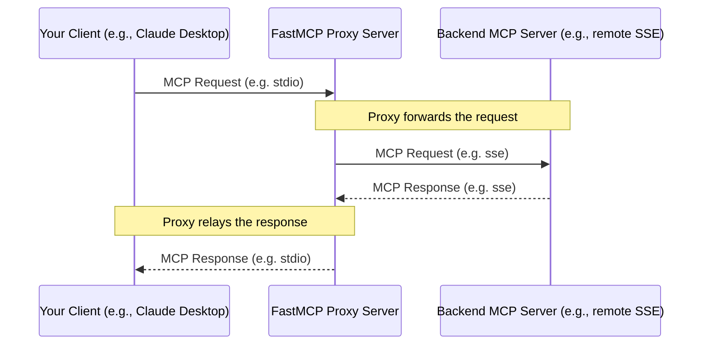

import { VersionBadge } from '/snippets/version-badge.mdx'

<VersionBadge version="2.0.0" />

FastMCP provides a powerful proxying capability that allows one FastMCP server instance to act as a frontend for another MCP server (which could be remote, running on a different transport, or even another FastMCP instance). This is achieved using the `FastMCP.as_proxy()` class method.

## What is Proxying?

Proxying means setting up a FastMCP server that doesn't implement its own tools or resources directly. Instead, when it receives a request (like `tools/call` or `resources/read`), it forwards that request to a *backend* MCP server, receives the response, and then relays that response back to the original client.



### Key Benefits

<VersionBadge version="2.10.3" />

- **Session Isolation**: Each request gets its own isolated session, ensuring safe concurrent operations
- **Transport Bridging**: Expose servers running on one transport via a different transport
- **Advanced MCP Features**: Automatic forwarding of sampling, elicitation, logging, and progress
- **Security**: Acts as a controlled gateway to backend servers
- **Simplicity**: Single endpoint even if backend location or transport changes

## Quick Start

<VersionBadge version="2.10.3" />

The recommended way to create a proxy is using `ProxyClient`, which provides full MCP feature support with automatic session isolation:

```python
from fastmcp import FastMCP
from fastmcp.server.proxy import ProxyClient

# Create a proxy with full MCP feature support
proxy = FastMCP.as_proxy(
    ProxyClient("backend_server.py"),
    name="MyProxy"
)

# Run the proxy (e.g., via stdio for Claude Desktop)
if __name__ == "__main__":
    proxy.run()
```

This single setup gives you:
- Safe concurrent request handling
- Automatic forwarding of advanced MCP features (sampling, elicitation, etc.)
- Session isolation to prevent context mixing
- Full compatibility with all MCP clients

## Session Isolation & Concurrency

<VersionBadge version="2.10.3" />

One of the most important features of FastMCP proxies is automatic session isolation. When multiple clients make simultaneous requests through the same proxy, each request operates with its own isolated session state.

```python
from fastmcp.server.proxy import ProxyClient

# This proxy can safely handle concurrent requests
proxy = FastMCP.as_proxy(ProxyClient("backend_server.py"))

# Multiple clients can use this proxy simultaneously without interference:
# - Client A calls a tool -> gets isolated session
# - Client B calls a tool -> gets different isolated session  
# - No context mixing between the requests
```

This solves common issues where concurrent operations would mix contexts or share state inappropriately.

## Transport Bridging

A common use case is bridging transports - exposing a server running on one transport via a different transport. For example, making a remote SSE server available locally via stdio:

```python
from fastmcp import FastMCP
from fastmcp.server.proxy import ProxyClient

# Bridge remote SSE server to local stdio
remote_proxy = FastMCP.as_proxy(
    ProxyClient("http://example.com/mcp/sse"),
    name="Remote-to-Local Bridge"
)

# Run locally via stdio for Claude Desktop
if __name__ == "__main__":
    remote_proxy.run()  # Defaults to stdio transport
```

Or expose a local server via HTTP for remote access:

```python
# Bridge local server to HTTP
local_proxy = FastMCP.as_proxy(
    ProxyClient("local_server.py"),
    name="Local-to-HTTP Bridge"
)

# Run via HTTP for remote clients
if __name__ == "__main__":
    local_proxy.run(transport="http", host="0.0.0.0", port=8080)
```


## Advanced MCP Features

<VersionBadge version="2.10.3" />

`ProxyClient` automatically forwards advanced MCP protocol features between the backend server and clients connected to the proxy, ensuring full MCP compatibility.

### Supported Features

- **Roots**: Forwards filesystem root access requests to the client
- **Sampling**: Forwards LLM completion requests from backend to client  
- **Elicitation**: Forwards user input requests to the client
- **Logging**: Forwards log messages from backend through to client
- **Progress**: Forwards progress notifications during long operations

```python
from fastmcp.server.proxy import ProxyClient

# ProxyClient automatically handles all these features
backend = ProxyClient("advanced_backend.py")
proxy = FastMCP.as_proxy(backend)

# When the backend server:
# - Requests LLM sampling -> forwarded to your client
# - Logs messages -> appear in your client
# - Reports progress -> shown in your client
# - Needs user input -> prompts your client
```

### Customizing Feature Support

You can selectively disable forwarding by passing `None` for specific handlers:

```python
# Disable sampling but keep other features
backend = ProxyClient(
    "backend_server.py",
    sampling_handler=None,  # Disable LLM sampling forwarding
    log_handler=None        # Disable log forwarding
)
```

When you use a transport string directly with `FastMCP.as_proxy()`, it automatically creates a `ProxyClient` internally to ensure full feature support.

## Configuration-Based Proxies

<VersionBadge version="2.4.0" />

You can create a proxy directly from a configuration dictionary that follows the MCPConfig schema. This is useful for quickly setting up proxies to remote servers without manually configuring each connection detail.

```python
from fastmcp import FastMCP

# Create a proxy directly from a config dictionary
config = {
    "mcpServers": {
        "default": {  # For single server configs, 'default' is commonly used
            "url": "https://example.com/mcp",
            "transport": "http"
        }
    }
}

# Create a proxy to the configured server (auto-creates ProxyClient)
proxy = FastMCP.as_proxy(config, name="Config-Based Proxy")

# Run the proxy with stdio transport for local access
if __name__ == "__main__":
    proxy.run()
```

<Note>
The MCPConfig format follows an emerging standard for MCP server configuration and may evolve as the specification matures. While FastMCP aims to maintain compatibility with future versions, be aware that field names or structure might change.
</Note>

### Multi-Server Configurations

You can create a proxy to multiple servers by specifying multiple entries in the config. They are automatically mounted with their config names as prefixes:

```python
# Multi-server configuration
config = {
    "mcpServers": {
        "weather": {
            "url": "https://weather-api.example.com/mcp",
            "transport": "http"
        },
        "calendar": {
            "url": "https://calendar-api.example.com/mcp",
            "transport": "http"
        }
    }
}

# Create a unified proxy to multiple servers
composite_proxy = FastMCP.as_proxy(config, name="Composite Proxy")

# Tools and resources are accessible with prefixes:
# - weather_get_forecast, calendar_add_event 
# - weather://weather/icons/sunny, calendar://calendar/events/today
```

## Alternative Approaches

The examples above show the recommended approach using `ProxyClient` or transport strings. For advanced use cases, you can also work directly with the underlying classes.

### Using Regular Client

You can pass a regular `Client` instance to `as_proxy()`. The proxy will automatically create an appropriate session strategy:

```python
from fastmcp import FastMCP, Client

# Using regular Client (session strategy auto-detected)
client = Client("backend_server.py")
proxy = FastMCP.as_proxy(client)
```

This approach provides session isolation but doesn't include advanced MCP feature forwarding (sampling, elicitation, etc.) unless you configure handlers manually.

## `FastMCPProxy` Class

Internally, `FastMCP.as_proxy()` uses the `FastMCPProxy` class. You generally don't need to interact with this class directly, but it's available if needed for advanced scenarios.

### Direct Usage

```python
from fastmcp.server.proxy import FastMCPProxy, ProxyClient

# Recommended - pass a ProxyClient for full MCP features
proxy_client = ProxyClient("backend_server.py")
proxy = FastMCPProxy(client=proxy_client)

# Advanced - provide a client factory for custom control
def create_client():
    return ProxyClient("backend_server.py")

proxy = FastMCPProxy(client_factory=create_client)
```

### Parameters

- **`client`**: A `Client` instance (preferably `ProxyClient`). The proxy automatically creates an appropriate session strategy for concurrent safety.
- **`client_factory`**: *(Advanced)* A callable that returns a `Client` instance when called. Use this for custom session management or when you need fine-grained control over client creation.

### How Session Strategies Work

When you provide a `client` parameter, `FastMCPProxy` automatically creates a session strategy based on the client's connection state:

- **Disconnected clients**: Creates fresh sessions per request (`lambda: client.new()`)
- **Connected clients**: Reuses the existing session (`lambda: client`)

For custom behavior, provide your own client factory:

```python
# Custom factory with specific configuration
def custom_client_factory():
    client = ProxyClient("backend_server.py")
    # Add any custom configuration here
    return client

proxy = FastMCPProxy(client_factory=custom_client_factory)
``` 