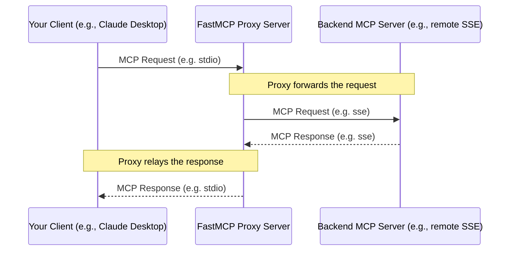

import { VersionBadge } from '/snippets/version-badge.mdx'

<VersionBadge version="2.0.0" />

FastMCP provides a powerful proxying capability that allows one FastMCP server instance to act as a frontend for another MCP server (which could be remote, running on a different transport, or even another FastMCP instance). This is achieved using the `FastMCP.as_proxy()` class method.

`as_proxy()` accepts either an existing `Client` or any argument that can be passed to a `Client` as its `transport` parameter&mdash;such as another `FastMCP` instance, a URL to a remote server, or an MCP configuration dictionary.

## What is Proxying?

Proxying means setting up a FastMCP server that doesn't implement its own tools or resources directly. Instead, when it receives a request (like `tools/call` or `resources/read`), it forwards that request to a *backend* MCP server, receives the response, and then relays that response back to the original client.

<Note>
As of version 2.10.3, FastMCP proxies automatically handle session management to ensure safe concurrent operations. When multiple clients make simultaneous requests through the same proxy, each request gets its own isolated session to prevent context mixing.
</Note>



### Use Cases

-   **Transport Bridging**: Expose a server running on one transport (e.g., a remote SSE server) via a different transport (e.g., local Stdio for Claude Desktop).
-   **Adding Functionality**: Insert a layer in front of an existing server to add caching, logging, authentication, or modify requests/responses (though direct modification requires subclassing `FastMCPProxy`).
-   **Security Boundary**: Use the proxy as a controlled gateway to an internal server.
-   **Simplifying Client Configuration**: Provide a single, stable endpoint (the proxy) even if the backend server's location or transport changes.

## Creating a Proxy

The easiest way to create a proxy is using the `FastMCP.as_proxy()` class method. This creates a standard FastMCP server that forwards requests to another MCP server.

```python
from fastmcp import FastMCP

# Provide the backend in any form accepted by Client
proxy_server = FastMCP.as_proxy(
    "backend_server.py",  # Could also be a FastMCP instance, config dict, or a remote URL
    name="MyProxyServer"  # Optional settings for the proxy
)

# Or create the Client yourself for custom configuration
backend_client = Client("backend_server.py")
proxy_from_client = FastMCP.as_proxy(backend_client)
```

**How `as_proxy` Works:**

1.  It connects to the backend server using the provided client.
2.  It discovers all the tools, resources, resource templates, and prompts available on the backend server.
3.  It creates corresponding "proxy" components that forward requests to the backend.
4.  It returns a standard `FastMCP` server instance that can be used like any other.

### Session Management and Concurrency

<VersionBadge version="2.10.3" />

`FastMCP.as_proxy()` automatically handles session management to ensure thread-safe concurrent operations:

- **Connected clients**: If you pass a connected `Client` instance to `as_proxy()`, it will reuse the existing session for all requests. This preserves backwards compatibility but may not be suitable for concurrent operations.
- **Disconnected clients**: If you pass a disconnected `Client` instance, `as_proxy()` will create fresh sessions for each request, ensuring safe concurrent operations.

```python
from fastmcp import FastMCP, Client

# Connected client - reuses sessions (backwards compatible)
connected_client = Client("backend_server.py")
await connected_client.connect()  # Client is now connected
proxy = FastMCP.as_proxy(connected_client)

# Disconnected client - creates fresh sessions per request (recommended for concurrency)
disconnected_client = Client("backend_server.py")
# Don't connect the client - as_proxy() will handle session creation
proxy = FastMCP.as_proxy(disconnected_client)
```

This automatic session management fixes concurrency issues where multiple simultaneous requests through the same proxy could mix contexts.

<Note>
Currently, proxying focuses primarily on exposing the major MCP objects (tools, resources, templates, and prompts). Some advanced MCP features like notifications and sampling are not fully supported in proxies in the current version. Support for these additional features may be added in future releases.
</Note>

### Bridging Transports

A common use case is to bridge transports. For example, making a remote SSE server available locally via Stdio:

```python
from fastmcp import FastMCP

# Target a remote SSE server directly by URL
proxy = FastMCP.as_proxy("http://example.com/mcp/sse", name="SSE to Stdio Proxy")

# The proxy can now be used with any transport
# No special handling needed - it works like any FastMCP server
```

### Concurrent-Safe Proxy Setup

For applications that need to handle multiple simultaneous requests, ensure you're using disconnected clients:

```python
from fastmcp import FastMCP, Client

# Create a disconnected client - as_proxy() will create fresh sessions per request
backend_client = Client("http://example.com/mcp/sse")
# Don't call await backend_client.connect() here

# This proxy will handle concurrent requests safely
concurrent_proxy = FastMCP.as_proxy(backend_client, name="Concurrent-Safe Proxy")
```

This pattern is especially important for web applications or services that may receive multiple simultaneous requests.

### In-Memory Proxies

You can also proxy an in-memory `FastMCP` instance, which is useful for adjusting the configuration or behavior of a server you don't completely control.

```python
from fastmcp import FastMCP

# Original server
original_server = FastMCP(name="Original")

@original_server.tool
def tool_a() -> str: 
    return "A"

# Create a proxy of the original server directly
proxy = FastMCP.as_proxy(
    original_server,
    name="Proxy Server"
)

# proxy is now a regular FastMCP server that forwards
# requests to original_server
```

### Configuration-Based Proxies

<VersionBadge version="2.4.0" />

You can create a proxy directly from a configuration dictionary that follows the MCPConfig schema. This is useful for quickly setting up proxies to remote servers without manually configuring each connection detail.

```python
from fastmcp import FastMCP

# Create a proxy directly from a config dictionary
config = {
    "mcpServers": {
        "default": {  # For single server configs, 'default' is commonly used
            "url": "https://example.com/mcp",
            "transport": "http"
        }
    }
}

# Create a proxy to the configured server
proxy = FastMCP.as_proxy(config, name="Config-Based Proxy")

# Run the proxy with stdio transport for local access
if __name__ == "__main__":
    proxy.run()
```

<Note>
The MCPConfig format follows an emerging standard for MCP server configuration and may evolve as the specification matures. While FastMCP aims to maintain compatibility with future versions, be aware that field names or structure might change.
</Note>

You can also use MCPConfig to create a proxy to multiple servers. When multiple servers are specified, they are automatically mounted with their config names as prefixes, providing a unified interface to all servers:

```python
from fastmcp import FastMCP

# Multi-server configuration
config = {
    "mcpServers": {
        "weather": {
            "url": "https://weather-api.example.com/mcp",
            "transport": "http"
        },
        "calendar": {
            "url": "https://calendar-api.example.com/mcp",
            "transport": "http"
        }
    }
}

# Create a proxy to multiple servers
composite_proxy = FastMCP.as_proxy(config, name="Composite Proxy")

# Tools and resources are accessible with prefixes:
# - weather_get_forecast, calendar_add_event 
# - weather://weather/icons/sunny, calendar://calendar/events/today
```

## Forwarding Interactions

`ProxyClient` is a subclass of `Client` that implements a set of default handlers to forward advanced interactions between the backend server and the client connected to the proxy. These handlers receive requests or notifications from the backend server and forward them to the client through the related request context, relaying the response back to the backend server if needed. This setup enables the proxy to support advanced MCP features, including roots, sampling, elicitation, logging, and progress.

To prevent the forwarding of any interaction, pass `None` to the corresponding handler when creating the `ProxyClient`. Typically, you should use `ProxyClient` to establish a proxy unless there is a specific reason not to. If the `transport` parameter is not an instance of `Client`, `FastMCP.as_proxy()` will automatically instantiate a `ProxyClient`.

## `FastMCPProxy` Class

<VersionBadge version="2.10.3" />

Internally, `FastMCP.as_proxy()` uses the `FastMCPProxy` class. You generally don't need to interact with this class directly, but it's available if needed for advanced scenarios.

### Direct Usage

```python
from fastmcp import Client
from fastmcp.server.proxy import FastMCPProxy

# Using client_factory (recommended)
def create_client():
    return Client("backend_server.py")

proxy = FastMCPProxy(client_factory=create_client)

# Using client parameter (deprecated)
client = Client("backend_server.py")
proxy = FastMCPProxy(client=client)  # Will show deprecation warning
```

### Parameters

- **`client_factory`**: A callable that returns a `Client` instance when called. This is the recommended approach as it ensures fresh sessions for each request, preventing concurrency issues.
- **`client`**: *(Deprecated)* A `Client` instance. This parameter is deprecated and will be removed in a future version. Use `client_factory` instead.

### Advanced Usage

Using the class directly might be necessary for advanced scenarios, like subclassing `FastMCPProxy` to add custom logic before or after forwarding requests:

```python
from fastmcp.server.proxy import FastMCPProxy

class CustomProxy(FastMCPProxy):
    async def handle_request(self, request):
        # Custom logic before forwarding
        result = await super().handle_request(request)
        # Custom logic after forwarding
        return result

proxy = CustomProxy(client_factory=lambda: Client("backend_server.py"))
```

## Migration from Client Parameter

<VersionBadge version="2.10.3" />

If you're using the deprecated `client` parameter in `FastMCPProxy`, here's how to migrate:

### Before (Deprecated)
```python
from fastmcp import Client
from fastmcp.server.proxy import FastMCPProxy

client = Client("backend_server.py")
proxy = FastMCPProxy(client=client)  # Deprecated
```

### After (Recommended)
```python
from fastmcp import Client
from fastmcp.server.proxy import FastMCPProxy

def create_client():
    return Client("backend_server.py")

proxy = FastMCPProxy(client_factory=create_client)  # Recommended
```

### Or Use `as_proxy()` (Simplest)
```python
from fastmcp import FastMCP, Client

# Let as_proxy() handle everything automatically
proxy = FastMCP.as_proxy(Client("backend_server.py"))
```

The `client_factory` approach ensures each request gets a fresh session, preventing context mixing in concurrent scenarios while maintaining full compatibility with all MCP features. 